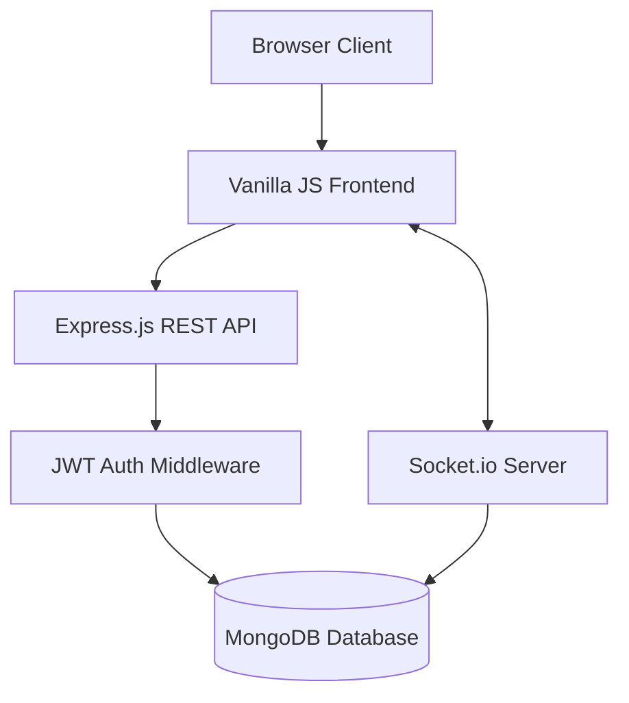

<div align="center">

# 🚀 BoardApp

### A modern, collaborative project management system — build, track and resolve tasks in one place.

<br/>

[](https://board-app-snowy.vercel.app/)
[](https://github.com/Nishanth2434/board-app/stargazers)
[](LICENSE)

[](https://developer.mozilla.org/en-US/docs/Web/JavaScript)
[](https://nodejs.org/)
[](https://mongodb.com)
[](https://socket.io)

</div>

---

## 🌐 Live Demo

<div align="center">

### Try the live website here 👇

<a href="https://board-app-snowy.vercel.app/">
  
</a>

<br/><br/>

| Area                   | Details                                              |
| :--------------------- | :--------------------------------------------------- |
| 🎓 **Demo Email**      | `demo@boardapp.com`                                  |
| 🛡️ **Demo Password**   | `demo1234`                                           |

</div>

---

## 📸 A Look Inside

<div align="center">

<b>🏠 Dashboard — view all your collaborative boards</b>


</div>

<table>
  <tr>
    <td width="50%"><b>🔐 User Login</b><br/></td>
    <td width="50%"><b>🛡️ Card Detail Modal</b><br/></td>
  </tr>
</table>

<div align="center">

<b>🛡️ Kanban Board — drag-and-drop tasks, real-time collaboration</b>


</div>

<div align="center">

🔒 The Kanban board, task assignment, and real-time activity feeds live behind login —
<a href="https://board-app-snowy.vercel.app/"><b>sign in on the live site</b></a> to see them in action.

</div>

---

## ✨ Features

<table>
  <tr>
    <td width="33%">
      <h3>🔐 Authentication</h3>
      Email & password login, secure JWT sessions, and password hashing with bcrypt.
    </td>
    <td width="33%">
      <h3>📝 Task Management</h3>
      Trello-style drag-and-drop Kanban boards with custom colored backgrounds.
    </td>
    <td width="33%">
      <h3>🛡️ Collaboration</h3>
      Invite members to boards and assign multiple members to specific task cards.
    </td>
  </tr>
  <tr>
    <td>
      <h3>💬 Live Comments</h3>
      Comment threads inside every task card for seamless team communication.
    </td>
    <td>
      <h3>🔔 Notifications</h3>
      In-app bell notifications and real-time popups when you are assigned or mentioned.
    </td>
    <td>
      <h3>⚡ Real-Time Sync</h3>
      WebSockets instantly sync board movements across all connected clients without refreshing.
    </td>
  </tr>
</table>

---

## 🧰 Tech Stack

| Layer               | Technology                                                |
| :------------------ | :-------------------------------------------------------- |
| **Frontend**        | HTML5, CSS3, Vanilla JavaScript (No heavy frameworks)     |
| **Backend**         | Node.js with Express.js REST API                          |
| **Database**        | MongoDB with Mongoose ORM                                 |
| **Authentication**  | JSON Web Tokens (JWT) & bcrypt                            |
| **Real-Time**       | Socket.io                                                 |
| **Hosting**         | Vercel (Frontend/Backend)                                 |
| **Version Control** | Git + GitHub                                              |

---

## 🏗️ Architecture

The app is a full-stack JavaScript application. The Vanilla JS frontend consumes the Express.js REST API. MongoDB stores all the relationships between users, boards, lists, and cards, while Socket.io maintains a persistent connection for real-time board updates.



---

## ⚙️ Installation

<details open>
<summary><b>1 · Clone the repository</b></summary>

```bash
git clone https://github.com/Nishanth2434/board-app.git
cd board-app
```

</details>

<details open>
<summary><b>2 · Install dependencies</b></summary>

```bash
npm install
```

</details>

<details open>
<summary><b>3 · Run the app (Zero Setup)</b></summary>

```bash
npm start
```

> **Note:** The project uses `mongodb-memory-server` by default so you don't even need to install MongoDB locally! It will automatically start an in-memory database and seed it with demo users and projects on the first run.

</details>

---

## 🤝 Contributing

Contributions make the open-source community amazing. Every PR is welcome!

<details open>
<summary><b>Contribution steps</b></summary>

1. **Fork** the repository
2. **Create a branch** — `git checkout -b feature/amazing-feature`
3. **Commit your changes** — `git commit -m "feat: add amazing feature"`
4. **Push the branch** — `git push origin feature/amazing-feature`
5. **Open a Pull Request** describing what changed and why

</details>

---

## 📄 License

Distributed under the **MIT License**.

```text
MIT License © 2026 NISHANTH B
```

---

## 👨‍💻 Author

<table>
  <tr>
    <td align="center" width="180">
      <br/>
      <b>NISHANTH B</b><br/>
      <sub>Full-Stack Developer</sub>
    </td>
    <td>
      <p>Built the BoardApp Collaborative Management Tool end-to-end — frontend design, REST API, WebSocket integration, and database schema.</p>
      <a href="https://github.com/Nishanth2434"></a>
    </td>
  </tr>
</table>

---

## 💖 Support

If this project helped you or you like what you see:

- ⭐ **Star** this repository
- 🍴 **Fork** it and build your own project
- 🐞 **Report bugs** in Issues

<div align="center">

### ⭐ Star the repo — it genuinely helps!

[](https://star-history.com/#Nishanth2434/board-app&Date)

</div>

---

<div align="center">

Made with ❤️ by **NISHANTH B**

<a href="https://board-app-snowy.vercel.app/"><b>🌐 Live Website</b></a> ·
<a href="#-features"><b>Features</b></a> ·
<a href="#-installation"><b>Install</b></a> ·
<a href="#-contributing"><b>Contribute</b></a>

<sub>BoardApp Collaborative Tool — plan it, track it, build it.</sub>

</div>
