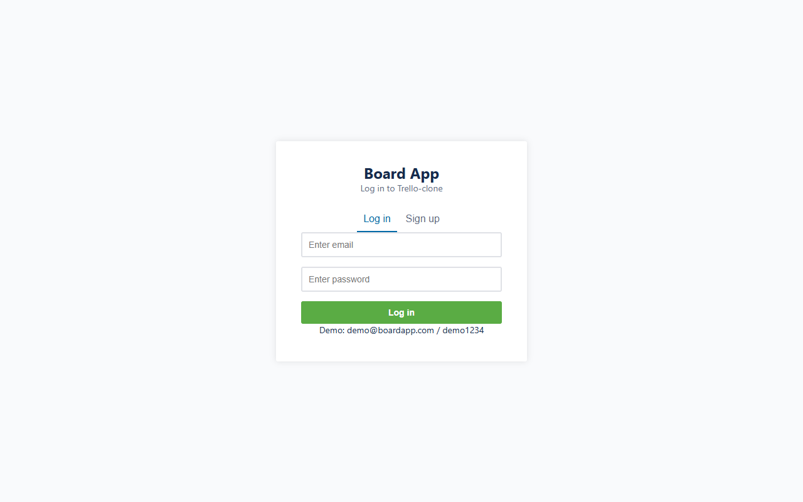
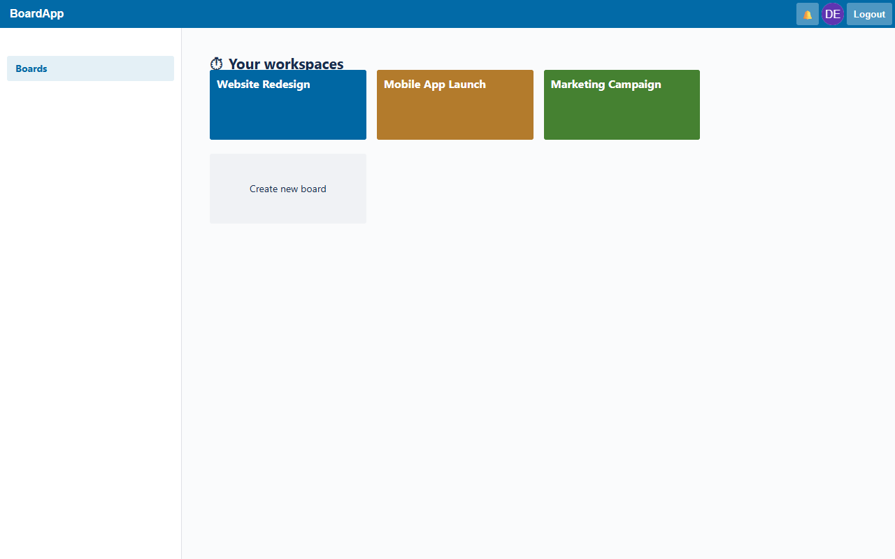
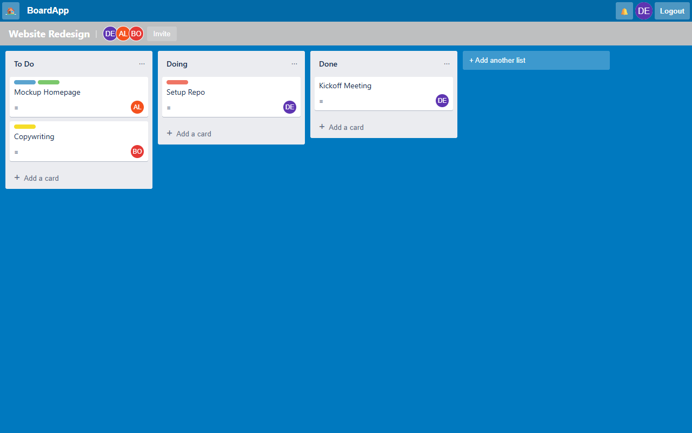
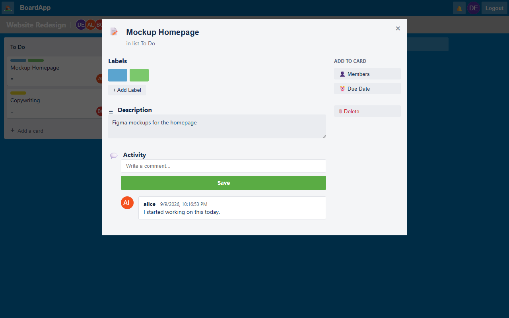

# BoardApp — Collaborative Project Management Tool 🚀

**🌍 Live Demo:** [https://board-app-snowy.vercel.app/](https://board-app-snowy.vercel.app/)

A full-stack, real-time Kanban board application built as a visual and functional clone of Trello. This project fulfills all requirements for **TASK 3: Project Management Tool**, including the WebSocket real-time bonus.

## 📸 Screenshots

| Login & Authentication | Board Dashboard |
|:---:|:---:|
|  |  |
| **Kanban Board View** | **Card Detail Modal** |
|  |  |

---

## 🎯 Features & Requirements Fulfilled

### ✅ Create Group Projects
- Users can create isolated workspaces (Boards) and choose custom background colors.
- Users can invite others to collaborate via email or username. 
- Only members of a board can access its contents.

### ✅ Assign Tasks
- Drag-and-drop task cards across Kanban columns (Lists).
- Assign one or more board members to any task.
- Add colored labels, set due dates, and write markdown-supported descriptions.

### ✅ Comment and Communicate within Tasks
- Every task card features an isolated activity feed.
- Users can post comments on cards which immediately display their avatar, username, and timestamp.

### ✅ Full Stack (Auth, Boards, Cards, Comments)
- **Frontend:** Pure HTML, CSS, and Vanilla JavaScript (No React/Vue). Clean, responsive, Trello-inspired CSS styling.
- **Backend:** Node.js with Express.js REST API.
- **Database:** MongoDB via Mongoose ORM.
- **Auth:** Secure JWT (JSON Web Token) session management with `bcrypt` password hashing.

### 🌟 BONUS: Notifications & Real-Time Updates (WebSockets)
- **Real-Time Board Sync:** Powered by `Socket.io`. Moving a card, adding a comment, or creating a list instantly updates the board for all other connected users without refreshing the page.
- **Notification Bell:** In-app notification system that alerts users when they are assigned to a task or when someone comments on a task they are tracking.

---

## 🛠️ Tech Stack

- **Client:** HTML5, CSS3, Vanilla JavaScript
- **Server:** Node.js, Express.js
- **Database:** MongoDB (uses `mongodb-memory-server` for zero-setup execution)
- **Real-Time:** Socket.io
- **Authentication:** JWT, bcrypt

---

## 🚀 How to Run (Zero Setup)

This application is designed to run out-of-the-box without requiring a local MongoDB installation or external API keys. It uses an in-memory MongoDB instance that automatically seeds itself with demo data on startup.

1. **Clone the repository:**
   ```bash
   git clone https://github.com/Nishanth2434/board-app.git
   cd board-app
   ```

2. **Install dependencies:**
   ```bash
   npm install
   ```

3. **Start the application:**
   ```bash
   npm start
   ```
   *(The server will start on port 5000 and automatically seed the database with demo users and populated boards).*

4. **Open in your browser:**
   Navigate to https://board-app-snowy.vercel.app/

---

## 🧪 Demo Account

You can explore the pre-populated boards using the seeded demo account:
- **Email:** `demo@boardapp.com`
- **Password:** `demo1234`

*The demo account is pre-loaded with multiple workspaces (Website Redesign, Mobile App Launch, Marketing Campaign) populated with colored labels, assigned tasks, and active comment threads.*
